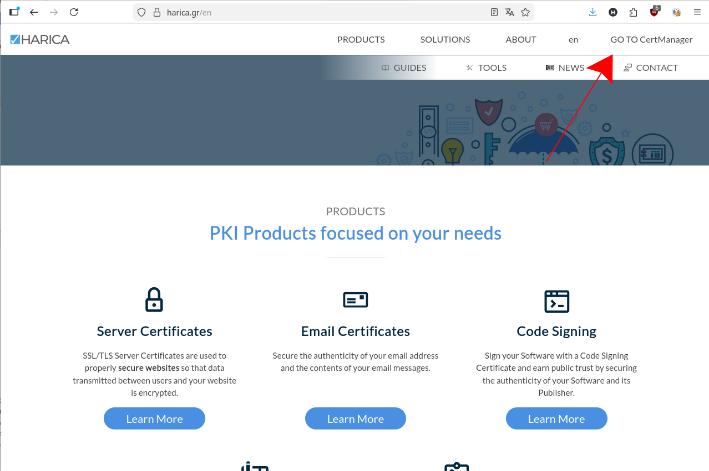
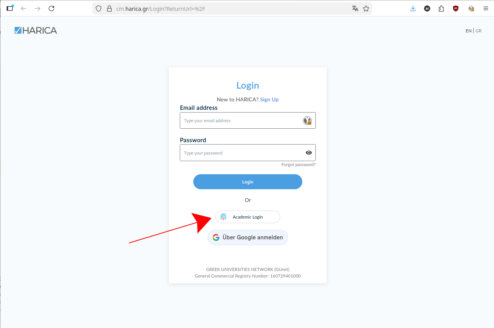
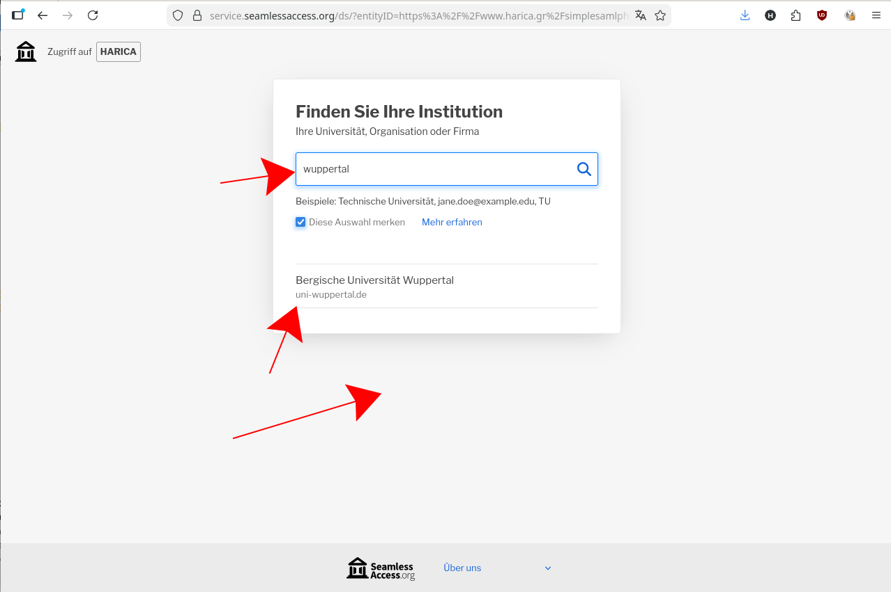
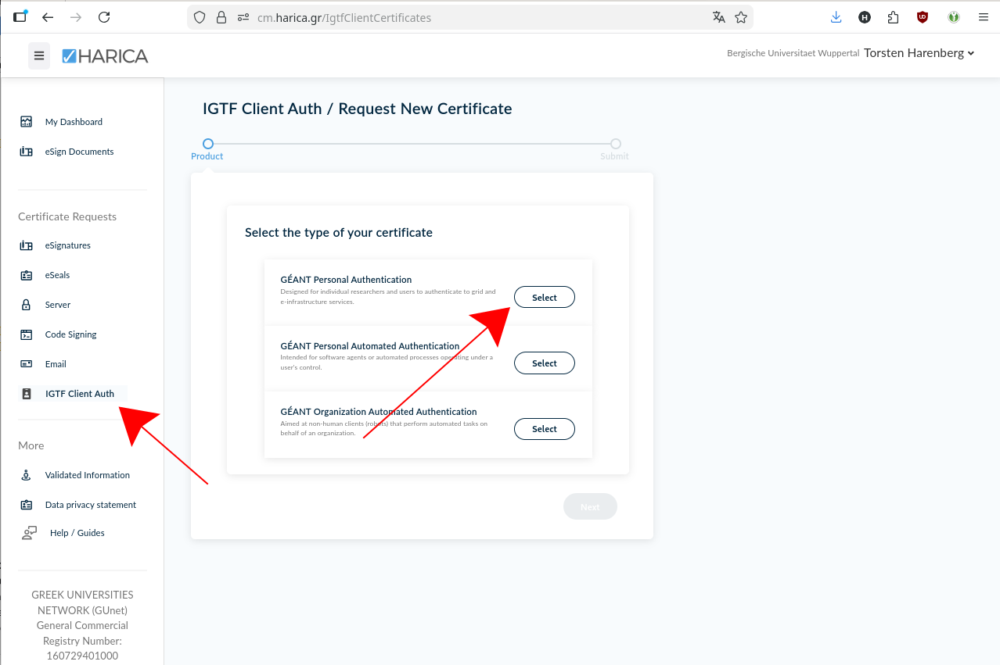
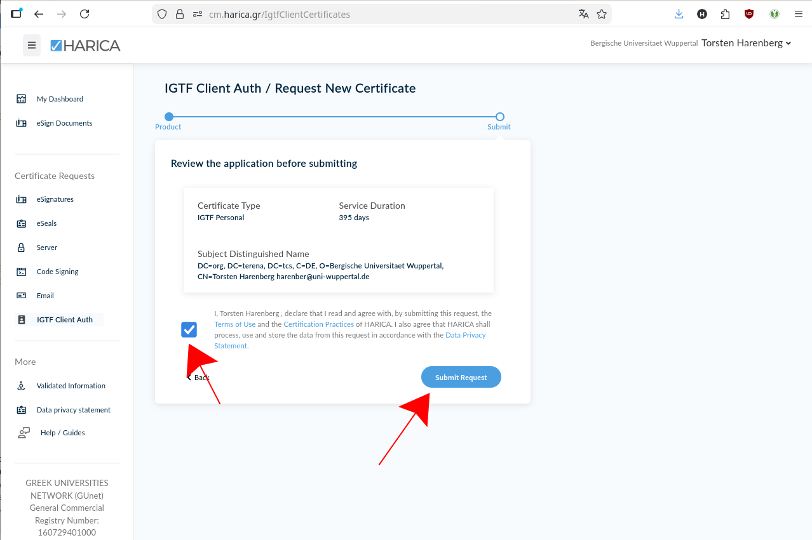
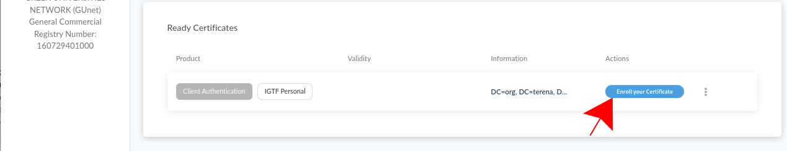

# wLCG Grid Certificates

## Background

After many many years, the German GridKa Certification Authority (CA) at KIT in Karlsruhe will cease operation at 11 June 2023 as the CA cert ends. 
As a successor the [GÉANT](https://geant.org/) Europe's leading collaboration on network and related infrastructure and services for the benefit of research and education offers the service "HARICA Certificate Manager" to obtain Grid user certificates starting now. In addition, we also offer certificates issued by the DFN (Deutsches Forschungsnetz).

## Introduction

On order to access global Grid resources, users must hold a valid personal Grid user certificate (authentication) AND users must be member of a Virtual Organization (VO) (authorization).
A valid Grid user certificate is a prerequisite to request membership in a VO. Users usually have one Grid user certificate. Multiple VO membership is possible.[^note]

A Grid user certificate (format X509) consists of a private key with a private password and a certified public key. The private key and the password is exclusively possessed by the user and is NOT known to the Registration Authority (RA) or Certification Authority (CA) at any stage.

A certificate is valid for one (1) year and can be renewed. Users get notified by the CA via email three (3) weeks before the expiration date. It is strongly recommended to renew the certificate before its expiration.

The certificate can/should be copied to all devices/browsers which need it.

[^note]: A Grid user certificate can be seen as an analogy to a passport, whereas the VO membership compares to a visa.

## Authorities

The [GÉANT](https://geant.org/) CA is part of The [International Grid Trust Federation (IGTF)](http://www.igtf.net/){:target="_blank" rel="noopener"}  hence Grid user certificates are accepted by all Grid sites in WLCG. In order to facilitate the request procedure, many institutions in Germany operated Registration Authorities (RA) which take over the necessary paper-work on behalf of the CA.

The procedure you need to follow to optain a certificate depends on the CA you want to use: HARICA or DFN. HARICA will allow you - once authorized - to get and renew your certificate solely based on your ZIM login. DFN is a more manual process, but has proven to work under all circumstaces.

## Procedure for HARICA

1. Send you ZIM login name (not the password of course!) to the PLEIADES team ([using the normal support email](mailto:pleiades@uni-wuppertal.de). Wait for a confirmation that your ZIM account was included in the lists of accounts who can generate a Grid certificate. **You only have to do it once** - the registration will be good for upcoming renewals of your certificate.
2. Visit the [HARICA Homepage](https://harica.gr/en), click on "GO TO CertManager": <br>[](assets/imgs/gridcert/Screen1.png)
3. Select "Academic Login":<br>[](assets/img/gridcert/Screen2.png)
4. Search for Wuppertal, select "Bergische Universität Wuppertal":<br>[](assets/img/gridcert/Screen3.png)
5. On the following page, select on the left column "IGTF Client Auth", then select "GÉANT Personal Authentication":<br>[](assets/img/gridcert/Screen4.png)<br>If you do **not** see the "IGTF Client Auth" on the left hand side, your ZIM account is not correctly authorized. Contact the PLEIADES crew.
6. On the following screen, your name and email are already filled in, just agree on the terms and click "submit request":<br> [](assets/img/gridcert/Screen5.png)
7. You should see your certificate under "Ready Certificate" after a few seconds. Click on "Enroll your Certificate":<br>[](assets/img/gridcert/Screen6.png)
8. On the last page, you download your certificate. **you can only do that once!**. Ensure that "Generate Certificate" is selected on top, enter a passphrase twice **do not forget this! We highly recommend to use a password manager to ensure that you already remember your chosen passphrase**. Tick the text on the button and finally click on "Enroll Certificate", which will download your new Grid certificate as `Certificate.p12` file. Store it at a safe place.
9. continue with the Common procedures below

## Procedure for DFN


1. Request a "Nutzerzertifikat"/"User certificate" at [the DFN PKI page for Wuppertal](https://pki.pca.dfn.de/dfn-pki/grid-root-ca/165). Keep the "Antragsdatei" (a json file) in a safe place and **do not loose it**. It contains your certificate key, which cannot be recovered if this file gets lost.
2. With the printed form, visit Torsten Harenberg together with a piece of government ID (national ID card or passport)
3. after a short while, you will receive an email with instructions how to download the new certificate. You will need the "Antragsdatei" generated in step 1 for that.
4. continue with the Common procedures below

## Common procedures

1. on Linux machines with Grid setups, the certificate and key files are usually placed in the directory ~/.globus/ 
   - Download the `certs.p12` file the User Cert Manager offers you.
   - copy it to `~/.globus/certs.p12`
   - Extract a **certificate** from it with `openssl pkcs12 -clcerts -nokeys  -in certs.p12 -out usercert.pem`
      - the certificate is your passport, you "show" to services to authenticate yourself
   - Extract a **key** from it with `openssl pkcs12 -nocerts -in certs.p12 -out userkey.pem`. 
   - **Make sure the key can only be read by yourself:** `chmod 400 userkey.pem`.
      - the key file is your secret key, that unlocks your certificate. Protect the key with a good password, do not share the key with anyone and backup the key, as it cannot be recovered, if the file got lost or you forgot the password
   - **in addition** import the certs.p12 into your browser:
      - Firefox: Settings → Certificates → View Certificates → Your Certificates → Import
      - Chrome: Settings → Security → Manage Certificates → Import (depends on your operating system, that's why we stongly recommend Firefox!)
2. with your user certificate as "passport" you have to register at your experiment/VO - so that your experiment/VO accepts your certificate and you can use experiment resources.
   - if you have already registered a (previous) certificate, you can add another certificate DN (DN= text string in your certificate, that identifies you) to your experiment account
   -  for **ATLAS**, this [IAM](https://atlas-auth.cern.ch/login){:target="_blank" rel="noopener"}  server is the central point for your registration
      - more information about Grid Certificate and VO Membership from an ATLAS point of view is available [here](https://confluence.desy.de/display/grid/Grid+User+Certificates+New){:target="_blank" rel="noopener"} 
3. Depending on your browser version, it might be necessary to check in your browser's certificate trust settings → the `The USERTRUST Network` certificate authority needs to be trusted for all operations
   - Firefox:
      - Settings → Certificates → View Certificates → Authorities
in the `The USERTRUST Network` block, select `Edit Trust` if for `GEANT eScience Personal CA` and ensure, that all trust settings are enabled 
   - Chrome:
      - Settings → Security → Manage Certificates → Authorities
search for `org-The USERTRUST Network` and ensure, that for both entries under `⋮` → Edit all trust settings are selected
4. to avoid problems with previous certificates, restart your browser after importing and backing up the certificate and key has been done.
I.e., to quit Firefox or Chrome explicitly select `Quit` or `Exit`, respectively, from the browsers' menues.
   -  if everything works with your new certificate, you can optionally delete your previous certificate

## Technicalities

Technically a new private/public key pair is created with every renewal.

### Finding certificates in Firefox browser

Preferences -> Privacy & Security -> Certificates -> View Certificates -> Your Certificates (-> Backup)

### Extracting the cert Files

Download/export the file either form the browser or directly to the ~/.globus/usercert.p12 directory and make sure to safe the old files. Then use openssl to extract ~/.globus/usercert.pem and ~/.globus/userkey.pem. Have your export passphrase at hand!

```bash
cd ~/.globus
 
 > mv certs.p12 certs.p12.old
 > mv usercert.pem usercert.pem.old
 > mv userkey.pem  userkey.pem.old
 
 > ls -l
-r-------- 1 account group 8213 24. Jan 14:36 certs.p12
-r-------- 1 account group 2611 31. Jan 13:40 certs.p12.old
 
 > openssl pkcs12 -clcerts -nokeys  -in certs.p12 -out usercert.pem
 > openssl pkcs12 -nocerts          -in certs.p12 -out userkey.pem
 
 > ls -l
-r-------- 1 account group 8213 24. Jan 14:36 certs.p12
-r-------- 1 account group 8213 24. Jan 14:38 usercert.pem
-r-------- 1 account group 2611 31. Jan 13:42 userkey.pem
```

### Inspecting Grid user certificates

Please make sure your public (usercert.pem) and private (userkey.pem) keys are:

- in the correct directory,
- have the correct permissions,
- show your DN,
- are valid,
- match each other (have the same md5sum),
- you remember the password.

```bash
> cd ~/.globus
 
 > ls -l
...
-r--r--r-- 1 account group  1728  8. Apr 09:36 usercert.pem
-r-------- 1 account group  2012  8. Apr 09:36 userkey.pem
 
 > openssl x509 -subject -issuer -dates -noout -in usercert.pem
subject= /DC=org/DC=terena/DC=tcs/C=DE/O=Bergische Universitaet Wuppertal/CN=Harenberg, Torsten harenber@uni-wuppertal.de
issuer= /C=NL/O=GEANT Vereniging/CN=GEANT eScience Personal CA 4
notBefore=Apr 20 00:00:00 2022 GMT
notAfter=Apr 20 23:59:59 2023 GMT
 
 > openssl x509 -noout -modulus -in usercert.pem | openssl md5
 > openssl rsa -noout -modulus -in userkey.pem   | openssl md5
 ```
 
