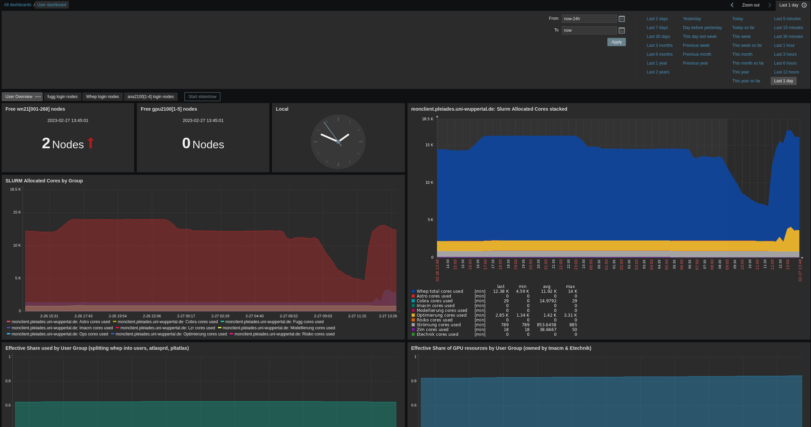
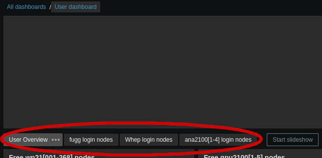
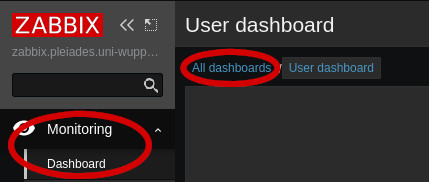
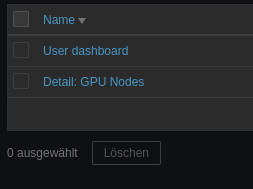
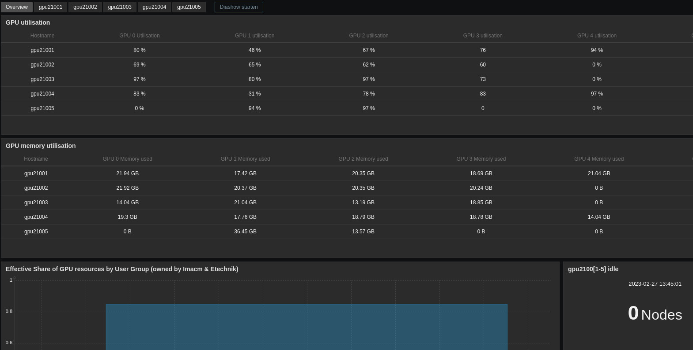
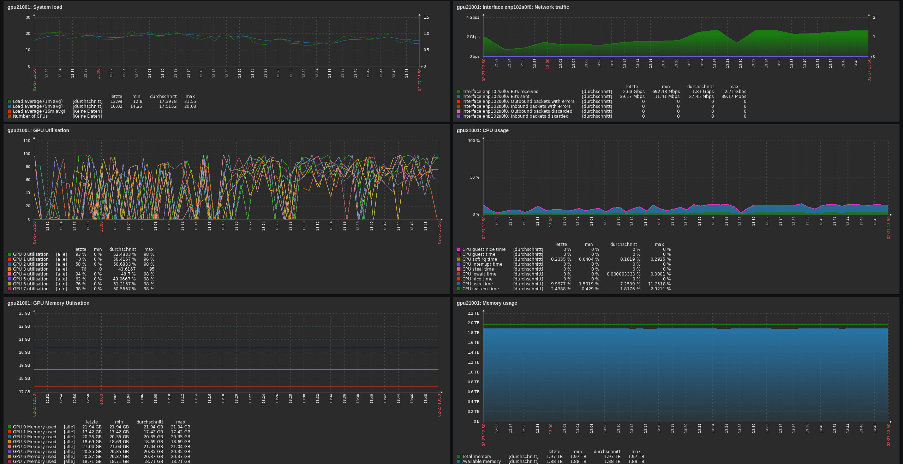
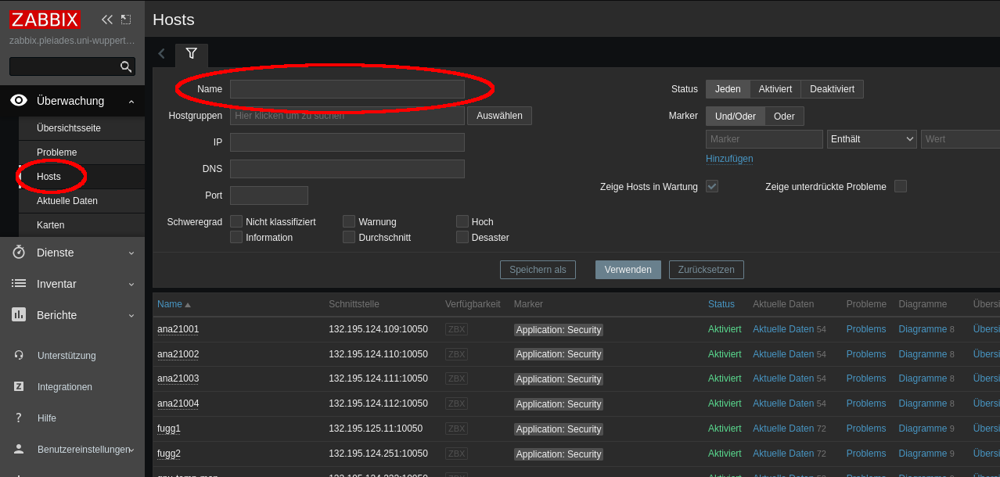
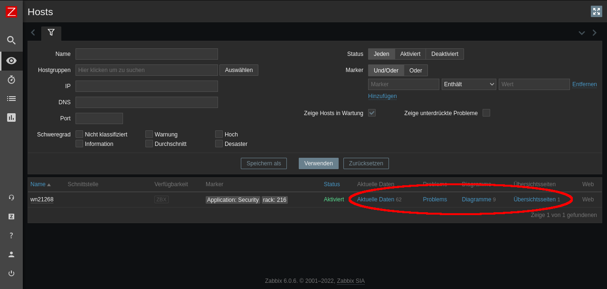

## Getting Started: Monitoring
Our monitoring service can be accessed at [zabbix.pleiades.uni-wuppertal.de](https://zabbix.pleiades.uni-wuppertal.de/) with the credentials "pleiades" and "pleiades".
Zabbix collects various information regarding current and past resource usage and quotas.

> **Note:** Zabbix is only accessible from the university network! If you are outside and need access, use the ZIMs webvpn.

### Dashboard
After login you are typically greeted by the user dashboard:

There are also multiple sub-pages available, covering an overview and login-node-specific metrics:

The overview dashboard presents aggregated metrics and you can select the time frame of presented information on the top right.
The visible widgets are:
* Number of free (idle) worker or gpu nodes
* Current time
* **SLURM Allocated Cores by Group** (2 plots): Current allocation of Cores per group as reported by Slurm
* **Effective Share used by User Group**: Slurm CPU resource usage for each group (resets each month)
* **Effective Spare of GPU resources by User Group**: Slurm GPU resource usage for each group (resets each month)
* **Beegfs Group Quota** (% and TB): Information on how much space is available on BeeGFS per group

More detailed pages about each class of login nodes provide information about:
* **Number of logged in users**
* **CPU usage**
* **Memory usage**

You can change the displayed dashboard through `Monitoring > Dashboard > All dashboards > User dashboard`:

All available user dashboards are:

### GPU Dashboard
Another dashboard shows detailed information of all five gpu nodes, `gpu2100[1-5]`:

You can select separate pages for each gpu node, which provide detailed information:

These pages can help you answer questions like:
* How much memory is available on a specific GPU? (8 GPUs per node)
* How good is the utilization of a specific GPU?
* How busy is the node CPU or memory?
* How busy is the nodes network interface?
* How much power does the GPU consume?

If you know which GPUs your job is using, or if you use a whole node exclusively, this approach can help to assess your software performance.

### Details of Specific Hosts
It is possible to show detailed information for specific hosts.
Start on the "Monitoring > Hosts" sub page:

Here you can search certain hosts, e.g. a node which is currently involved in processing your Slurm job.
You can use `squeue -u $USER` or `scontrol show job <jobid>` to get the list of nodes that are processing your job.

Keep in mind that nodes are shared between jobs!
If you need an exact performance assessment, use the `--exclusive` flag during job submission to disallow concurrent jobs at the cost of longer waiting times and billing the whole node(s).

For each host, you can list all available data, show all predefined diagrams, or a show simple dashboard:

This approach can tell you how well your job utilizes available CPU, memory, InfiniBand, Ethernet, or GPU resources.
