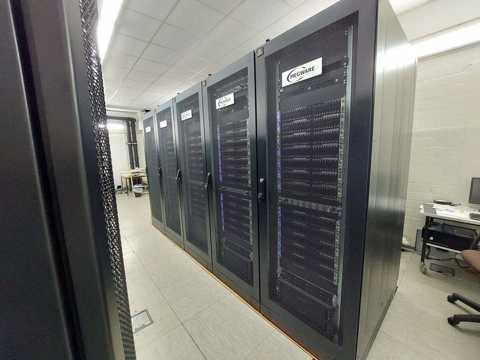

### PLEIADES User Documentation
Welcome to the user documentation of the Scientific Computing Center PLEIADES, at the University of Wuppertal.
This page provides an introduction to our cluster, as well as best practices and answers to common questions.

If you are a new user, please **read our [getting started guide](gettingstarted)** and the [hardware description](hardware).
There is also more information about Slurm, using GPU nodes, MPI, and available software.

In case of further questions you can contact us at

**pleiades{at}uni-wuppertal.de**

### More Resources
  - [Official PLEIADES page](http://pleiades.uni-wuppertal.de/) with public information and recent news
  - The [**hpc-wiki.info**](https://hpc-wiki.info/) contains many useful explanations about HPC topics, as well as [tutorials](https://hpc-wiki.info/hpc/Category:Tutorials), covering
    - Linux introduction
    - Profiling with gprof
    - OpenMP porgramming
    - GPU programming

