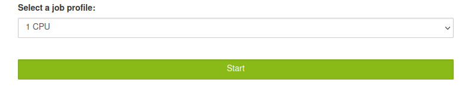
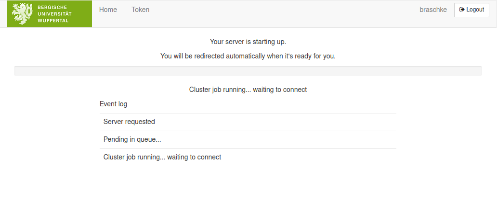
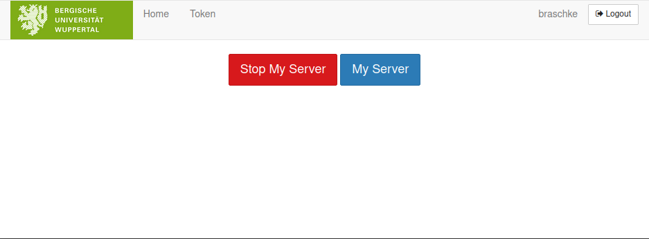

## Jupyter: JupyterHub on PLEIADES

PLEIADES provides users with easy access to a JupyterLab graphical user interface (GUI) that comes with preset resources. This is possible through a JupyterHub virtual machine that can only be reached from within the university's network. Depending on the user's location, a VPN may be necessary to access it. From the JupyterHub interface, users can automatically spawn JupyterLab servers and connect to them. The procedure for spawning is technically identical to batching any other job on PLEIADES. Therefore, depending on the current cluster load, it may take some time until the JupyterLab server job leaves the pending status (*PD*). Even after the job is already running (status *R*), it may take a few seconds for JupyterLab to establish a connection with JupyterHub because some modules need to be loaded from BeeGFS.

### JupyterHub: Available resources

Users cannot adjust computational resources individually. Instead, the Scientific Computing Center PLEIADES provides multiple profiles with different resources that users can choose from. These profiles have been designed to make it easy for users to interact with their code for the purpose of performance analysis and quick evaluation. If users require a more customized resource setup, we also [provide a guide]({{ site.baseurl }}) to interactive Jupyter-notebook sessions with individually set resource requirements.  
  
If you are using Python packages in your simulations, you need to make sure, that they are also available in your JuyterLab server sessions. If you were using your own Python installation, which is not *Python 3.10.4*, you will need to install the packages again with *Python 3.10.4*. The easiest way to do so is to start a JupyterLab server through JupyterHub and to open a bash terminal inside (*File-&gt;New-&gt;Terminal*). This ensures that the right `pip` installation will be used for `python pip install --user <PACKAGE>`.

### JupyterHub: Access and usage

To access the JupyterHub VM, users can [follow this link](https://jupyterhub.pleiades.uni-wuppertal.de/).
  
Any important information about the cluster, such as planned maintenance, will be displayed here as well. Users will be asked to enter their credentials, which are the same as their PLEIADES account. Once users have signed in and assuming they have no JupyterLab server instance running, they will be directed to the profile spawn menu. Otherwise, they will be directed to their running JupyterLab server.

The available resources in the provided profiles are designed to give users the possibility of interactively evaluating their code and analyzing its multiprocessor capabilities. The following limitations apply to the JupyterLab servers initialized through JupyterHub:

* Runtime of JupyterLab servers is limited to 1 day.
* If jobs spend more than 8 hours with the pending status *PD*, they will be automatically cancelled. This is to prevent unattended JupyterLab servers from spawning and occupying valuable resources.
* Profiles with multiple CPUs or GPUs still have to spawn jobs on one single node. This means that a profile offering 4 CPUs will batch a job that waits until at least 4 CPUs are free on one node. Users should keep this in mind when available resources are limited.

Once a profile has been selected, users can batch the JupyterLab server job by clicking on the "Start" button. This will automatically redirect users to the spawning screen, where they will remain until the job is running and connects to JupyterHub. Depending on the current cluster load, this can take some time. The graphic below shows a spawning screen with an open Event Log (opened by clicking on it).

Here users can see, that

1. A server has been requested, i.e. a job has been submitted.
2. The job has been pending in the queue (status *PD*).
3. The job has started and JupyterHub is now awaiting a connection to the JupyterLab server.

Please note that the cluster job running (point 3) is usually not identical to the JupyterLab server being available. The batched job contains other instructions besides starting the actual JupyterLab server, and therefore it might take some time before a running job actually connects to JupyterHub.
  
  
Once the connection to the JupyterLab server is established, the JupyterLab UI will be displayed as shown below.
  

  
A comprehensive guide on how to use JupyterLab and its various features can be found [in the official documentation](https://jupyterlab.readthedocs.io/en/stable/user/interface.html).
  
It is crucial to properly terminate your JupyterLab session as closing your browser window or logging out will not close the JupyterLab server. To end your session correctly, first, navigate to the Hub Control Panel by clicking on *File-&gt;Hub Control Panel* located in the top left corner of the interface. This will open the Hub Control Panel in a new window as shown below:
  

  
Clicking on *My Server* or on the logo of the BUW will bring you back to your running JupyterLab server, whereas clicking on *Stop my Server* will terminate the job. Depending on the cluster load, this might take some time, however, after clicking on *Stop my Server* you are free to close all windows.  
If you are unable to terminate your server for any reason, you can always cancel the job manually by entering `scancel <JOBID>` in the terminal on the cluster, just like any other job on SLURM.

#### Using virtual environments for custom IPython kernels

It is possible to define your own IPython kernels based on virtual environments created and managed through *Conda* or a combination of *pip* and *venv*. We describe this in detail in our section on the [custom IPython kernels](./jupyter-kernels.md).
  
### JupyterHub: FAQ
* **What versions are you using?**  
We are using *JupyterHub 3.1.1* and *JupyterLab 3.5.0*.
* **I have mutliple jobs running on the cluster. How do I know which one is the JupyterLab server?**  
All JuypterLab server jobs get the same name, *spawner-jupyterhub*, although only a few characters might be visible when entering `squeue -u <USERNAME>`.
* **I want to check my JuypterLab logfiles. Where are they located?**  
The logfiles belonging to the JupyterLab job (not just for JupyterLab itself) are always written to the users home directory and have the following naming convention: *jupyterhub_slurmspawner_&lt;JOBID&gt;.log*
* **I would love to have more resources available for my JupyterLab session. Is this possible?**  
Yes, you can manually configure and submit a JupyterLab server without using JupyterHub. Instructions on how to do this are provided [here]({{ site.baseurl }}). 
* **Why can't I find my Python packages?**  
Please see the section [Available Resources](#jupyterhub:-available-resources) to ensure you have installed the packages into the right Python directory.

