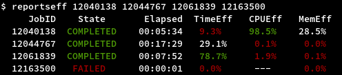

## Slurm: Job Performance

### `seff` and sending mails
All login nodes and the slurm controller provide the `seff` utility script.
With `seff` gives a quick overview of a jobs performance, e.g.

```
user@login$ seff 23320079
Job ID: 23320079
Cluster: pleiades
User/Group: ...user.../...group...
State: COMPLETED (exit code 0)
Cores: 1
CPU Utilized: 00:00:13
CPU Efficiency: 19.12% of 00:01:08 core-walltime
Job Wall-clock time: 00:01:08
Memory Utilized: 3.86 MB
Memory Efficiency: 0.00% of 16.00 
```

The metrics are:
* **CPU Utilized**: How many seconds the CPU were busy
* **CPU Efficiency**: Ratio of active CPU time to the maximum possible with requested number of cores
* **Job Wall-clock time**: How long the job was running
* **Memory Utilized**: Largest seen memory utilization
* **Memory Efficiency**: How much of the requested memory was used at peak

Slurm is able to send mail notifications about a job state with the the `--mail-user` and `--mail-type` options of `srun` and `sbatch`:
```
$ sbatch --mail-user=myaccount@uni-wuppertal.de --mail-type=BEGIN,END,FAIL jobscript.sh
```
Here, `BEGIN,END,FAIL` is a list of events where notifications are send, i.e. when the job starts, stops, or fails.
For all available mail-types, refer to [slurm.schedmd.com/sbatch.html](https://slurm.schedmd.com/sbatch.html#OPT_mail-type).

The `seff` script is automatically executed and sent together with the `END` notification, to inform about the job performance.


### Reportseff
The third party script [reportseff](https://github.com/troycomi/reportseff) has been installed on all login nodes.
It can provide a quick overview of your jobs performance:

[](../assets/img/reportseff.png)

* **TimeEff**: How much of the requested job time has been used
* **CPUEff**: Ratio of active CPU time to the maximum possible with requested number of cores
* **MemEff**: How much of the requested memory was used at peak

#### Parameters
You can use `reportseff -u <username>` to show all jobs from the past week.
If the output is weird, use `--no-color` to disable the color command line parameters.

#### Interpretation
A low TimeEff means, you can use a shorter time limit for your job, which is easier and faster to be scheduled by Slurm.
A TImeEff 100% occurs, if your job hits the maximum time limit.

A low CPUEff means, your job is not utilizing the requested cores very well.
They could be limited by network or disk I/O.
If you suspect the disk I/O, try working in a local work directory in `/tmp`.
If the application itself is inefficient at scaling to larger numbers of cores, you could run with less cores or try to optimize the application itself.

A large MemEff means, your job is utilizing the requested memory.
Everything below 100% is probably fine, as long as your job runs as expected.
A very large percentage above 100% could mean that your application expects more than 3800MB of memory per core.
In this case, submit your job with a specific `--mem` request or increase the number of cores without using them.
If MemEff gets exceedingly large, your job might be canceled (out of memory), which can be caused by memory leaks etc.

