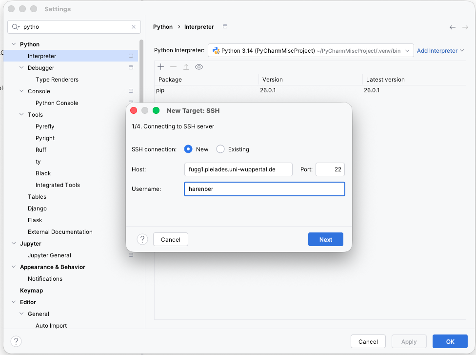
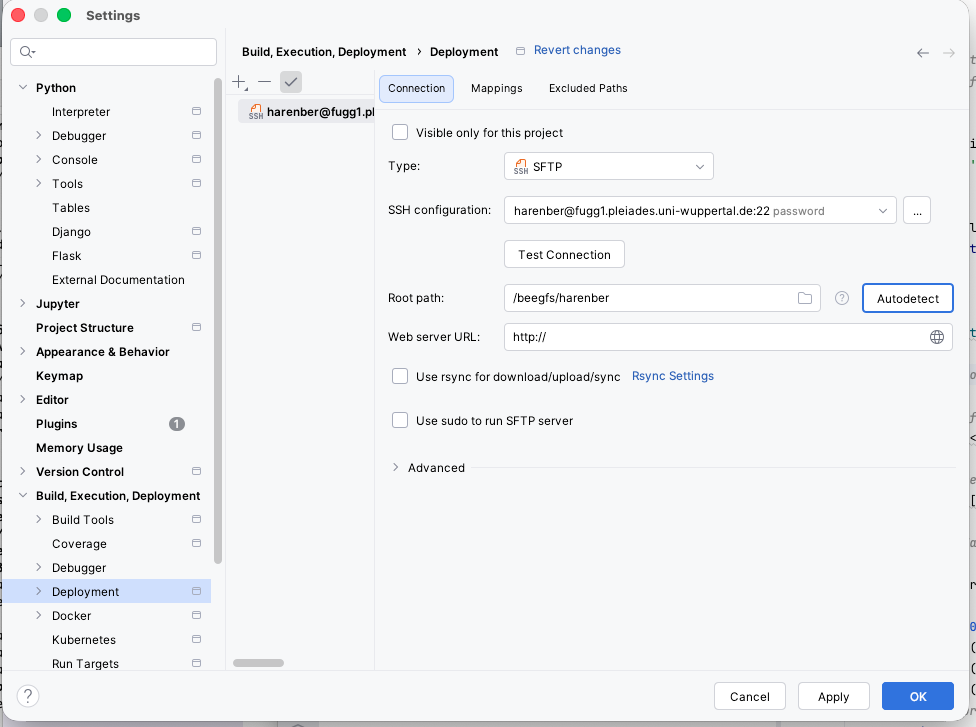
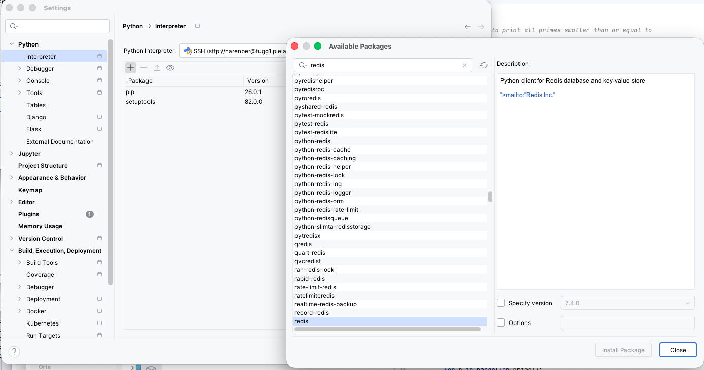
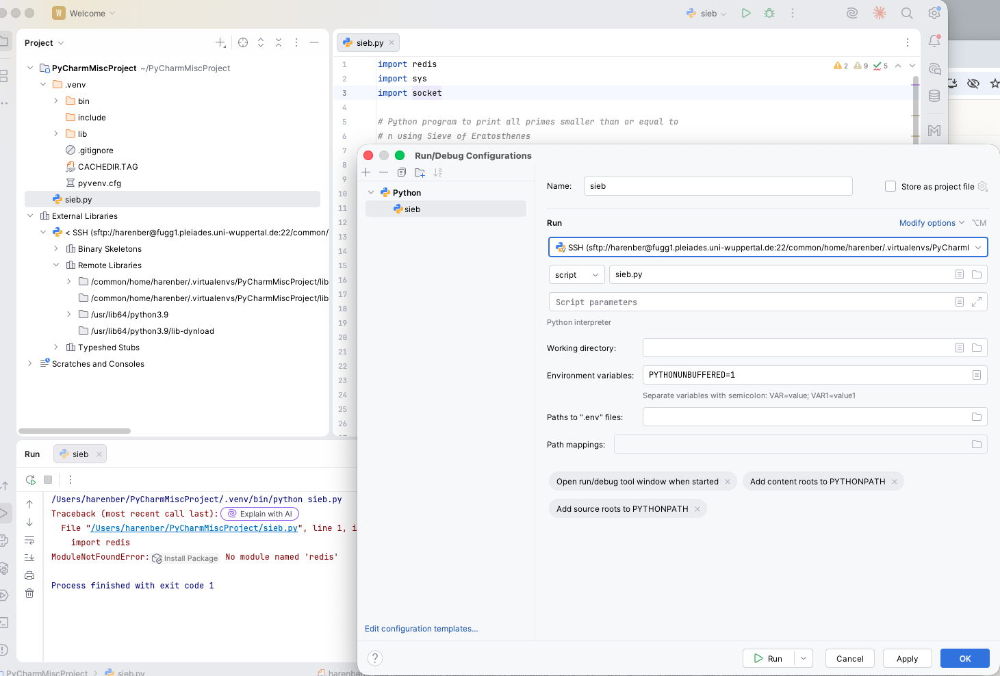
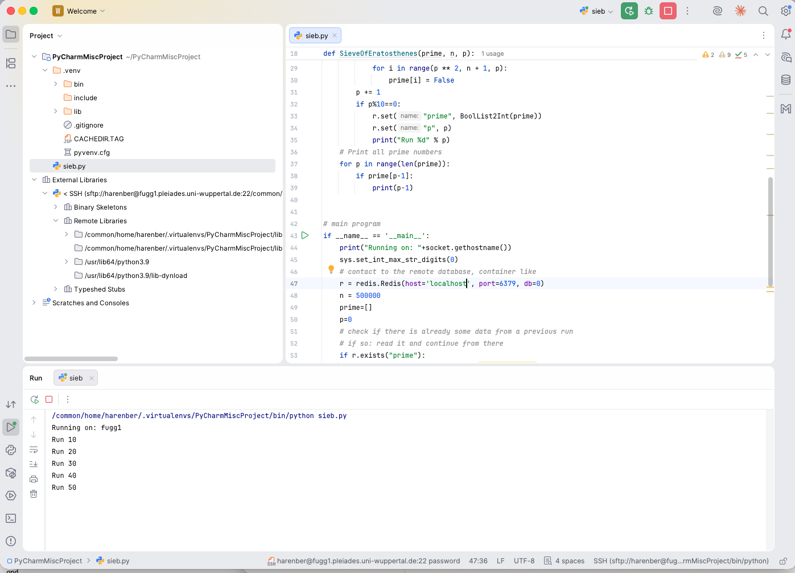
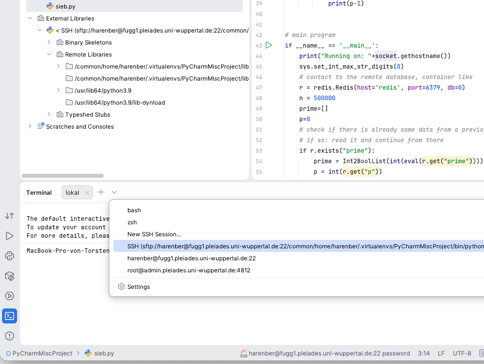

# Using PyCharm Pro with PLEIADES

Note: this documentation is beta!

Important: PyCharm Pro should run on **your laptop/desktop**. It makes no sense to run it on the PLEIADES login nodes.
This guide will help you setup PyCharm so that you can work remotely on PLEIADES without any additional overhead on the login nodes.
So your project will run remotely on PLEIADES, which also makes you independent of your local operating system. 

Remember to open the VPN connection to the Wuppertal University.

## Step 1: Install PyCharm Pro (only needed once)

PyCharm is available from the [vendor's homepage](https://www.jetbrains.com/pycharm/). If you're using MacOS with homebrew, a simple `brew install pycharm`
will do the trick.

If you haven't created a Jetbrains account yet, you'll need to do so **with your University address** in order to get free access
to the "Pro" features. See the [Free Jetbrains student pack](https://www.jetbrains.com/academy/student-pack/) web page. 

Activate Pro on the upper right corner with your Jetbrains Account.

## Step 2: configure remote access to PLEIADES

Once setup, you'll need to tell PyCharm that you want to develop remotely.

For this, you'll have to open a project (existing or new one).

### 2.1: add remote SSH connection

Go to: Settings->Python->Interpreter. Click on "Add Interpreter" and configure the ssh connection:

Sometimes, the last step (4) hangs, in which case just close the window and start over. The last step can take around 30 seconds. 

### 2.2: confgure remote deployment

Go to: Settings->Build, Execution, Deployment -> Deployment

Verify that the remote connection is there (should be automatically), click on `Autodetect` at `Root path`. You screen should look like this:

### Step 2.3: adding modules remotely

If your python project needs additional Python modules, go to

Settings->Python->Interpreter->(check that the remote connection is selected)->click on the small `+` and choose your package

## Step 3: Setting the "configuration"

In Jetbrains IDEs you configure a "configuration" which defines your build enviroment.

In the window there is on the right hand side a small Python icon followed by some text and a green right arrow. This is the place
where you define these environments, click in the small "pull-down-arrow", which opens "Run/Debug Configurations", select "Python",
the SSH connection should already be there, at "script" you'd need to tell him which your main Python file is, that's it.

## Running your code.

A click on the green right arrow on the upper right corner should now run your code nicely:

## Optional: remote SSH into your project

A remote terminal is always nice to have. Once you finished the steps above, the Terminal feature (lower left corner of PyCharm) should
have an entry now which brings you immediately into your project:

