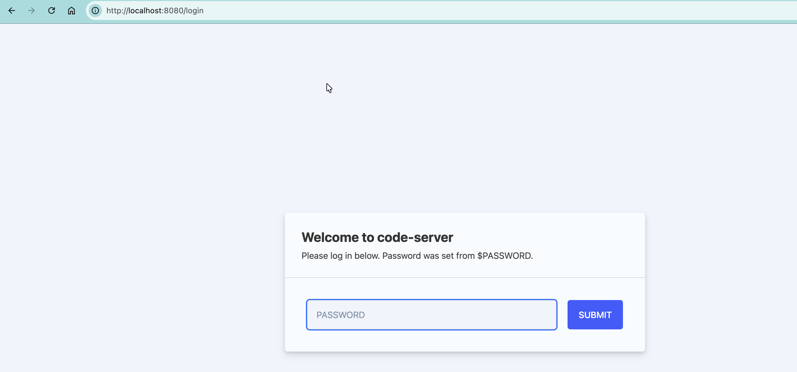
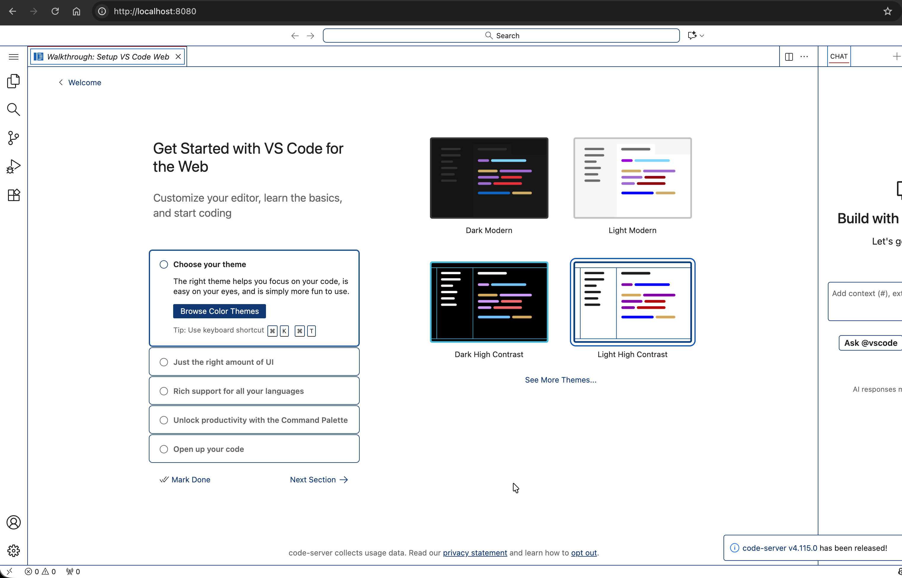
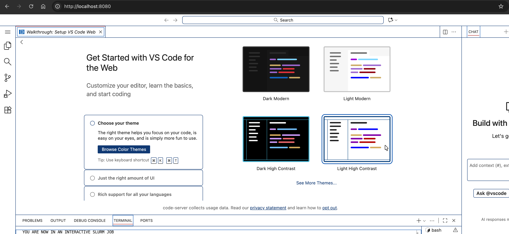
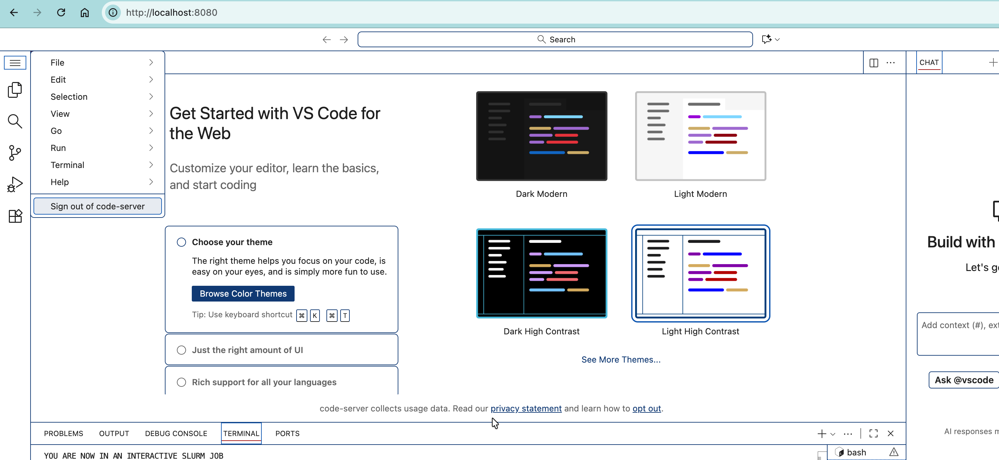

# Using VS Code with PLEIADES

Important Notes:

- **Do not use VS Code Remote SSH from your local machine.**
  Connecting via SSH directly from the VS Code desktop application can lead to significant resource contention on login nodes due to multiple background processes (e.g., language servers, file watchers).
- This guide describes how to use VS Code via `code-server` in a web browser environment.
  This ensures that all workloads run on compute nodes, avoiding unnecessary load on login nodes.
- Your development environment runs entirely on PLEIADES, making you independent of your local operating system. 
- **Ensure that you are connected to the Wuppertal University VPN before starting.** 

## Step 1: Configure OpenSSH (one-time setup)

Add the following to your `~/.ssh/config` file:

```
Host fugg1 fugg2
    Hostname %h.pleiades.uni-wuppertal.de

Match Host fugg1.pleiades.uni-wuppertal.de,fugg2.pleiades.uni-wuppertal.de
    User user
    IdentityFile ~/.ssh/pleiades
    ControlMaster no
    ControlPath ~/.ssh/control-%h-%p-%r
    ControlPersist 2h
```

## Step 2: Connect to the Login Node

From your local terminal:

```
ssh fugg1
```

### Step 2.1: Allocate an Interactive Compute Node

Example:

```
srun --ntasks=1 --nodes=1 --partition=short --time=00:30:00 --pty /bin/bash
```

Check job status:

```
squeue --me
```

Example output:

```
             JOBID PARTITION     NAME     USER ST       TIME  NODES NODELIST(REASON)
          19252299    normal     bash     user  R      00:02      1 wn21101
```

Take note of the compute node hostname (e.g., `wn21101`), as it will be required in the next step.

### Step 2.2: Start the `code-server` on the compute node

Load the required module:

```
module load 2025 code-server/4.105.1
```

Run the following command on the compute node:
```
PASSWORD=test code-server --bind-addr 0.0.0.0:8080 --auth password
```

- Replace `test` with a secure password.
- Port `8080` is used for access via SSH port forwarding from your local machine.

Terminal Output:

```
[user@wn21101 software]$ PASSWORD=test code-server --bind-addr 0.0.0.0:8080 --auth password
[2026-04-09T21:29:16.860Z] info  code-server 4.105.1 811ec6c1d60add2eb92446161ca812828fdbaa7f
[2026-04-09T21:29:16.926Z] info  Using user-data-dir /common/home/user/.local/share/code-server
[2026-04-09T21:29:16.959Z] info  Using config file /common/home/user/.config/code-server/config.yaml
[2026-04-09T21:29:16.959Z] info  HTTP server listening on http://0.0.0.0:8080/
[2026-04-09T21:29:16.960Z] info    - Authentication is enabled
[2026-04-09T21:29:16.960Z] info      - Using password from $PASSWORD
[2026-04-09T21:29:16.960Z] info    - Not serving HTTPS
[2026-04-09T21:29:16.960Z] info  Session server listening on /common/home/user/.local/share/code-server/code-server-ipc.sock
```

**Security Note**

Binding to `0.0.0.0` exposes the service on all network interfaces.
Always use authentication (`--auth password`) to prevent unauthorized access.

## Step 3: Access VS Code from Your Local Machine

On your **local machine**, open or launch a new terminal and run:

```
ssh -L 8080:wn21101:8080 fugg1
```

Replace `wn21101` with your allocated compute node.
Keep this SSH session open while using VS Code in your browser.
Then open a browser and navigate to `http://localhost:8080`.

[](../assets/img/vscode/01_localhost_login.png)

> #### **Do not use `0.0.0.0` in the browser URL.**

Enter the password:
- either from `~/.config/code-server/config.yaml`
- or the one set using `PASSWORD` variable. 

After authentication, the VS Code Interface will be available in your browser.

[](../assets/img/vscode/02_afterlogin.png)

[](../assets/img/vscode/03_terminalaccess.png)

## Step 4: Terminate the Session

- To logout:
  Use "Sign out of code-server" from the application menu.
- To stop the service:
  Press `Ctrl + C` in the terminal running `code-server`.

[](../assets/img/vscode/04_signout.png)

## Summary

- VS Code runs on **compute nodes**
- Login nodes act only as **SSH gateways**
- Resource usage is **controlled via SLURM**
- No unnecessary load is placed on login nodes

### Key Takeaway

> #### VS Code workloads must be executed on compute nodes using `code-server`; login nodes should only be used for access and orchestration.
